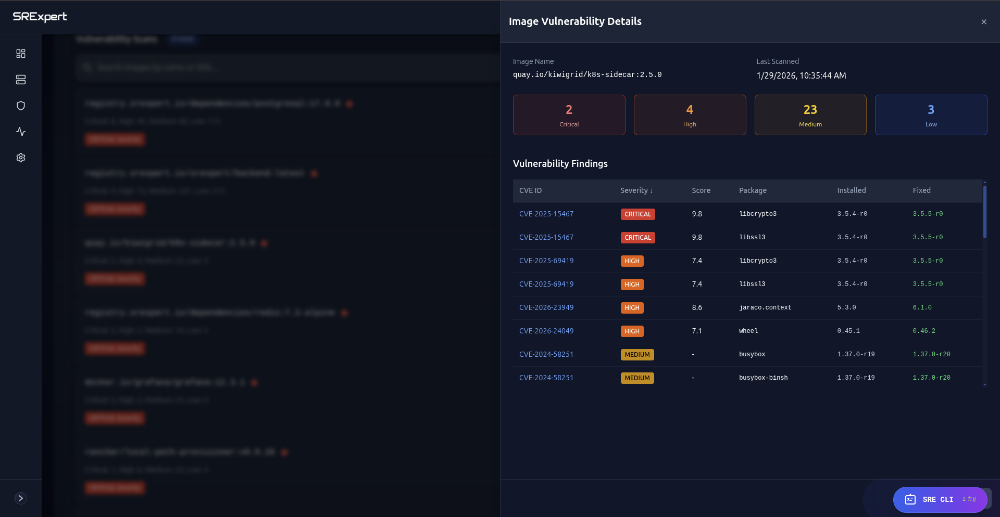
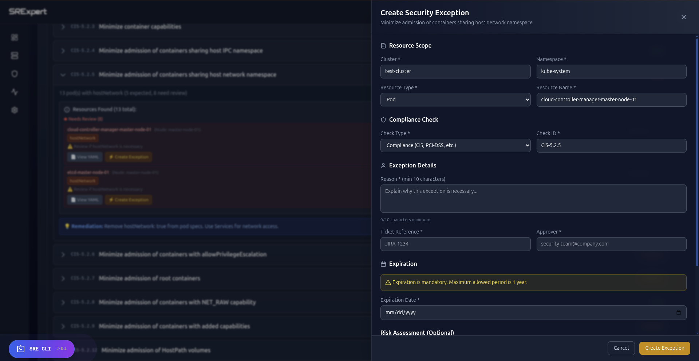

# SRExpert

### The Kubernetes Security & Operations Platform

**One platform replacing Lens + Rancher + security scanners + compliance tooling + ChatOps.**

[**Get started free →**](https://srexpert.cloud?utm_source=github&utm_medium=readme) · [Website](https://srexpert.cloud?utm_source=github&utm_medium=readme) · [Contact Sales](mailto:contact@srexpert.cloud)

*No credit card required.*

---

## Why SRExpert

Running Kubernetes in production usually means juggling a fleet of tools: one for cluster management, another for security scanning, a third for compliance, plus separate alerting and ChatOps. They don't talk to each other, and the bill adds up fast.

**SRExpert brings it into a single platform** — manage every cluster, scan for vulnerabilities and misconfigurations, prove compliance, enforce policy, and operate from chat or an AI terminal. Connect a cluster and see results in seconds.

- **Unify your stack** — multi-cluster ops, security, compliance, alerting and ChatOps in one place
- **See risk in seconds** — CVEs, exposed secrets and risky RBAC surfaced the moment you connect
- **Prove compliance** — SOC 2, ISO, PCI and HIPAA coverage out of the box
- **Operate with AI** — ask the SRE CLI, get answers and actions across your clusters
- **Runs anywhere** — EKS, GKE, AKS or fully on-prem

---

## Features

### 🌐 Multi-Cluster Management
A single pane of glass across all your clusters — workloads, nodes, namespaces and health, no `kubectl` context juggling.

### 🔒 Security Scanning
Deep scanning for **CVEs, exposed secrets and risky RBAC**, with image vulnerability analysis across your registries.

### ✅ Compliance
Continuous coverage for **SOC 2, ISO 27001, PCI-DSS and HIPAA** — with exceptions and exemptions when you need them.

### 🛡️ Policy Enforcement
Enforce guardrails with **OPA / Gatekeeper** policies — catch misconfigurations before they reach production.

### 🔔 Alerting & ChatOps
Configurable alert rules wired into **Slack and Discord**, so the right people hear about issues where they already work.

### 🤖 AI-Powered Operations
An SRE CLI backed by **6 LLMs** — investigate incidents, query clusters and take action in natural language.

---

## SRExpert vs Alternatives

| Capability | SRExpert | Lens | Rancher | Datadog | Komodor |
|---|:---:|:---:|:---:|:---:|:---:|
| Multi-cluster management | **Yes** | No | Yes | Yes | Yes |
| Security scanning (CVE, secrets, RBAC) | **Deep** | No | Basic | Basic | Limited |
| Compliance (SOC 2, ISO, PCI, HIPAA) | **Full** | No | No | Limited | No |
| AI-powered operations (6 LLMs) | **Yes** | No | No | No | No |
| Policy enforcement (OPA/Gatekeeper) | **Yes** | No | Yes | No | No |
| ChatOps (Slack + Discord) | **Yes** | No | Limited | Yes | Yes |
| Free tier | **Yes** | Yes | No | No | No |

---

## Integrations

| | |
|---|---|
| **Cloud & platforms** | Amazon EKS · Google GKE · Azure AKS · On-Prem / self-managed |
| **ChatOps** | Slack · Discord |
| **Policy** | OPA / Gatekeeper |
| **AI providers** | 6 LLMs |

---

## Quick Start

1. **Sign up** at [srexpert.cloud](https://srexpert.cloud?utm_source=github&utm_medium=readme)
2. **Connect** a cluster
3. **Scan** — see results in seconds
4. **Act** — start operating from the platform

---

## Pricing

| Plan | Price | Users | Clusters |
|---|---|---|---|
| **Starter** | **Free forever** | 1 | 1 |
| Professional | €89/mo | 5 | 5 |
| Business | €399/mo | 20 | 20 |
| Enterprise | Custom | Unlimited | Unlimited |

**Enterprise** includes custom SLAs, dedicated support, SSO / SAML and audit logs — [contact@srexpert.cloud](mailto:contact@srexpert.cloud).

---

## Support

- **GitHub Issues** — feature requests & bugs
- **Website** — [srexpert.cloud](https://srexpert.cloud?utm_source=github&utm_medium=readme)
- **Email** — [contact@srexpert.cloud](mailto:contact@srexpert.cloud)

---

## License

Proprietary — All Rights Reserved. See [LICENSE](LICENSE).

© 2026 SRExpert. SRExpert is a commercial product; this repository contains its public documentation and brand assets.
