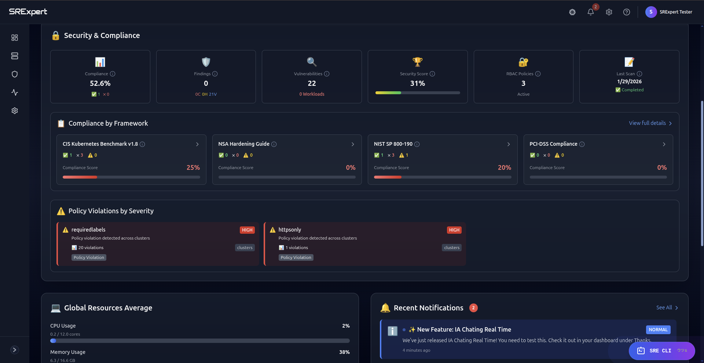
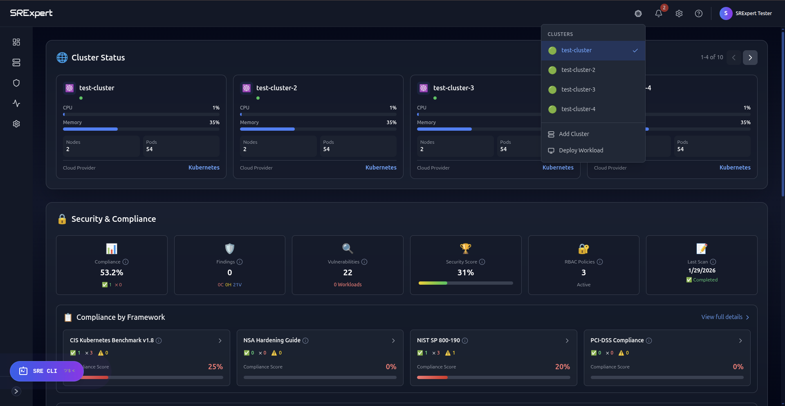
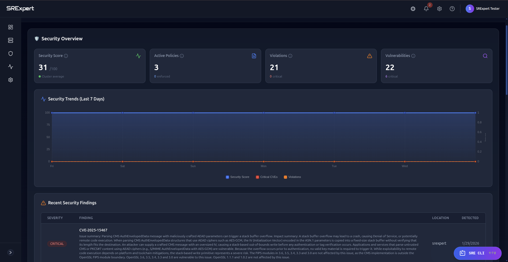
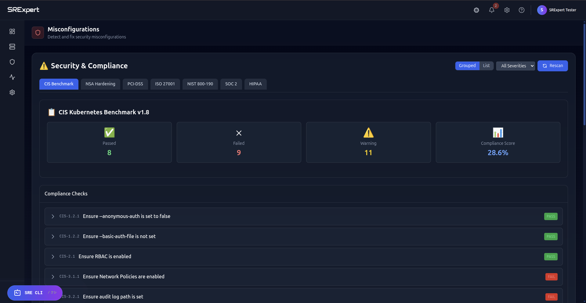
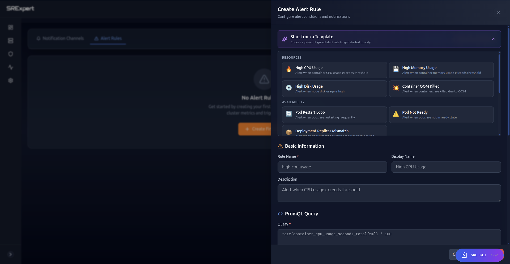
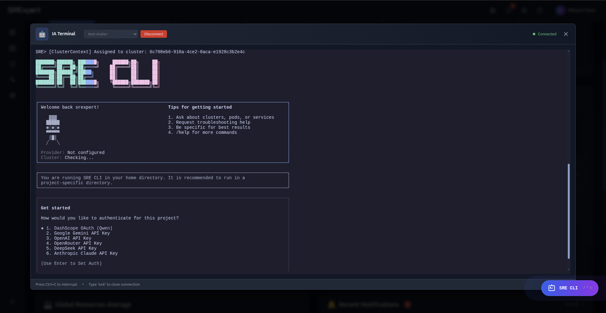

# SRExpert

**The Kubernetes Security & Operations Platform**

One platform replacing Lens + Rancher + security scanners + compliance tooling + ChatOps.

> [Get started free at srexpert.cloud](https://srexpert.cloud?utm_source=github&utm_medium=readme) — no credit card required.

---

## SRExpert vs Alternatives

| Capability | SRExpert | Lens | Rancher | Datadog | Komodor |
|---|:---:|:---:|:---:|:---:|:---:|
| Multi-cluster management | **Yes** | No | Yes | Yes | Yes |
| Security scanning (CVE, secrets, RBAC) | **Deep** | No | Basic | Basic | Limited |
| Compliance (SOC 2, ISO, PCI, HIPAA) | **Full** | No | No | Limited | No |
| AI-powered operations (6 LLMs) | **Yes** | No | No | No | No |
| Policy enforcement (OPA/Gatekeeper) | **Yes** | No | Yes | No | No |
| ChatOps (Slack + Discord) | **Yes** | No | Limited | Yes | Yes |
| Free tier | **Yes** | Yes | No | No | No |

---

## Product

---

## Quick Start

1. **Sign up** at [srexpert.cloud](https://srexpert.cloud?utm_source=github&utm_medium=readme)
2. **Connect** a cluster
3. **Scan** — see results in seconds
4. **Act** — start operating from the platform

---

## Pricing

| Plan | Price | Users | Clusters |
|---|---|---|---|
| **Starter** | **Free forever** | 1 | 1 |
| Professional | €89/mo | 5 | 5 |
| Business | €399/mo | 20 | 20 |
| Enterprise | Custom | Unlimited | Unlimited |

Enterprise: custom SLAs, dedicated support, SSO/SAML, audit logs — **contact@srexpert.cloud**

---

## Support

- **GitHub Issues** — feature requests & bugs
- **Website** — [srexpert.cloud](https://srexpert.cloud?utm_source=github&utm_medium=readme)
- **Email** — contact@srexpert.cloud

## License

Proprietary. All rights reserved.
